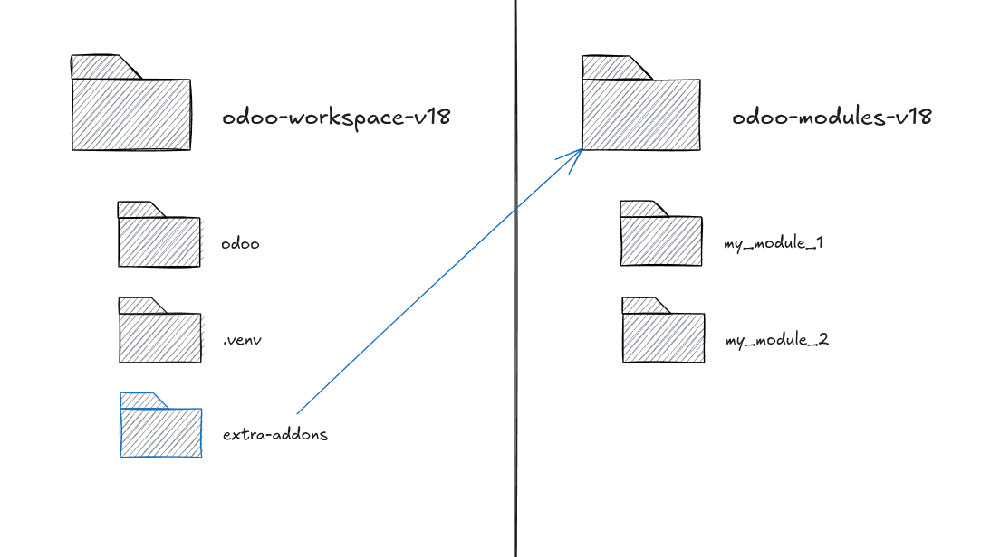

# odoo-workspace-v18 #

## About ##

A repository for setting up a local installation of [Odoo](https://www.odoo.com/) 18.

This setup aims to simplify setting up a local instance of Odoo. It consists on having a folder containing the workspace plus another containing all installable modules.



Modules could be managed locally or added through a symbolic link to a external folder (preferred).

## Features ##

 - Local private environment managed through `pyenv`.
 - Docker Compose setup, including PostgreSQL and Adminer.
 - Easy IDE setup.

## Requirements ##

 - `git`
 - `make`
 - `pyenv`
 - Docker + Compose Plugin

## Setup ##

Clone this repository along with its submodules. This will add the `odoo` repository pointing to the `18.0` branch.

```sh
 git clone --recurse-submodules
```

Proceed to create the virtual ennironment by running `make setup`. This will create a new virtual environment in `.venv`.

To activate the virtual environment and install the dependencies run `make install`. This will install all packages included in `requirements.txt`.

**Note***: the list of dependencies has been modified to avoid certain issues with some packages (specifically `gevent` and `greenlet`).

Additionally, if your setup defines an external *addons* folder (like the one in the image) you can create a *symlink* to it by hand (`ln -s /path/to/addons extra-addons`) or by running `make symlink`.

## Configuration ##

The repository already includes an `odoo.conf` file. Adjust the value pointing to the addons folder (`addons_path`). Then, either copy this file to the `odoo` folder (`cp odoo.conf odoo/`) or create a symbolic link to it (`ln -s $(pwd)/odoo.conf odoo/odoo.conf`).

## Docker ##

A Docker Compose file is already included with this repository. This file reads the environment variables from `.env`. You can create one using the template:

```
 cp env-example .env
```

Containers are connected through an external network (`odoo_workspace`). Run `make network` to create it. Once done, start both containers by doing `docker compose up -d`. This will run `postgres` at `5432` and `adminer` at `8081`. The database port IS EXPOSED.

In order to access the database from Adminer use the following values:

 - Engine: PostgreSQL
 - Host: postgres
 - User: odoo
 - Password: pgsecret

## IDE Integration ##

### PyCharm ###

Open the workspace folder and go to the *Settings*. Add a new *Interpreter* and pick the one installed in `.venv` (`$WORKPACE_DIR/.venv/bin/python3.10`). Verify that the list of packages is correct.

Add a new *Run Configuration*. Make sure it uses the same interpreter declared in the previous step. Select the `script` option from the list and set the executable path to `$WORKPACE_DIR/odoo/odoo-bin`. Add the following flags: `-c odoo.conf`. Set the *Working Directory* as the one including the `odoo` repository (`$WORKPACE_DIR/odoo`).

Apply changes and run.

## Additional targets ##

### activate ###

Activates the virtual environment. It assumes you already did the setup.

### up ###

Runs `docker compose up -d`

### down ###

Runs `docker compose down`

### purge ###

Closes all running containers and deletes the database volume. **Warning**: This will DELETE all data from your Odoo instance.

### update ###

It updates the `odoo` repository with the latest changes.

## Extras ##

Looking for a fully dockerized environment? Check [this repo](https://github.com/emaphp/odoo-starter-docker) instead.

## License ##

Released under MIT.
